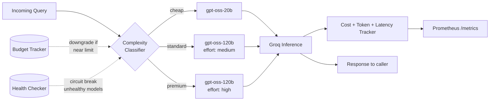

<div align="center">

# ⚡ llm-cost-router

**Route every LLM query to the cheapest model that can actually handle it.**

A production-patterned model router that classifies query complexity, routes across tiers,
tracks cost per request in real time, and degrades gracefully when things go wrong.

[](https://www.python.org/)
[](https://fastapi.tiangolo.com/)
[](https://groq.com/)
[](LICENSE)
[](https://prometheus.io/)

[Quickstart](#-quickstart) •
[How it works](#-how-it-works) •
[API](#-api) •
[Metrics](#-metrics) •
[Roadmap](#-roadmap)

</div>

---

## 💡 Why this exists

Every LLM query, no matter how trivial, costs the same to send to your most expensive model
as it does to your cheapest one — unless something in between is making a decision. This project
is that decision layer:

- **"What's the capital of France?"** → cheap, fast model
- **"Design a database schema for a multi-tenant billing system"** → capable model, higher cost, justified

No routing logic = you're either overpaying on every trivial query, or under-provisioning on
the queries that actually need a stronger model. This router picks per-request, tracks what
it spent, and degrades safely when budgets or providers misbehave.

## 📐 How it works



| Layer              | Responsibility                                                                             |
| ------------------ | ------------------------------------------------------------------------------------------ |
| **Classifier**     | Heuristic scoring of query complexity → tier (`cheap` / `standard` / `premium`)            |
| **Router**         | Picks the actual model for a tier, applying budget and health overrides                    |
| **Budget Tracker** | Per-user spend tracking; auto-downgrades users near their limit                            |
| **Health Checker** | Circuit breaker — stops routing to a model after repeated failures, retries after cooldown |
| **Cost Tracker**   | Computes $ cost per request from token usage, exports to Prometheus                        |

## ✨ Features

- 🎯 **Complexity-aware routing** — heuristic classifier, no extra API call needed for the common case
- 💰 **Per-request cost tracking** — exact $ cost computed from real token usage, not estimates
- 🛡️ **Budget-aware downgrading** — users near their spend cap get routed to cheaper tiers automatically instead of erroring
- 🔌 **Circuit breaker** — unhealthy models get skipped, traffic resumes after a cooldown
- 📊 **Prometheus-native metrics** — cost, tokens, and latency, all labeled by model/tier/user
- 🧪 **Testable classifier** — labeled eval set + pytest suite to catch regressions before they ship
- 🆓 **Zero-cost to run locally** — built and tested against Groq's free tier

## 🏗️ Tech Stack

| Component          | Choice                                             |
| ------------------ | -------------------------------------------------- |
| API framework      | FastAPI + Uvicorn                                  |
| Inference provider | Groq (`openai/gpt-oss-20b`, `openai/gpt-oss-120b`) |
| Metrics            | `prometheus-client`                                |
| Testing            | Pytest                                             |
| Config             | `python-dotenv`                                    |

## 🚀 Quickstart

```bash
# 1. Clone and enter the project
git clone https://github.com/rooneyrulz/llm-cost-router.git
cd llm-cost-router

# 2. Create a virtual environment
python -m venv venv
source venv/bin/activate      # Windows: venv\Scripts\activate

# 3. Install dependencies
pip install -r requirements.txt

# 4. Add your free Groq API key
echo "GROQ_API_KEY=your_key_here" > .env

# 5. Run it
uvicorn app.main:app --reload --port 8000
```

Test it:

```bash
curl -X POST http://localhost:8000/chat \
  -H "Content-Type: application/json" \
  -d '{"query": "What is the capital of France?"}'
```

```json
{
    "answer": "The capital of France is Paris.",
    "tier": "cheap",
    "model": "openai/gpt-oss-20b",
    "routing_reason": "classifier",
    "cost_usd": 0.000012,
    "latency_s": 0.41,
    "total_user_spend_usd": 0.000012
}
```

## 📁 Project Structure

```
llm-cost-router/
├── app/
│   ├── main.py           # FastAPI app + /chat, /metrics, /health endpoints
│   ├── config.py         # Model registry — tiers, pricing, Groq model IDs
│   ├── classifier.py     # Heuristic complexity classifier
│   ├── router.py         # Routing logic (budget + health aware)
│   ├── budget.py         # Per-user spend tracking
│   ├── health.py         # Circuit breaker for model health
│   ├── cost_tracker.py   # Prometheus metrics + cost computation
│   └── groq_client.py    # Groq API wrapper
├── tests/
│   └── test_classifier.py
├── eval/
│   ├── eval_set.json     # Labeled queries for classifier validation
│   └── run_eval.py
├── requirements.txt
└── .env                  # GROQ_API_KEY (not committed)
```

## 🔌 API

### `POST /chat`

| Field     | Type     | Description                                                    |
| --------- | -------- | -------------------------------------------------------------- |
| `query`   | `string` | The user's message                                             |
| `user_id` | `string` | Optional, defaults to `"test-user"` — used for budget tracking |

**Response**

| Field                  | Description                                             |
| ---------------------- | ------------------------------------------------------- |
| `answer`               | Model's response text                                   |
| `tier`                 | Which tier the query was routed to                      |
| `model`                | Actual Groq model ID used                               |
| `routing_reason`       | `classifier` \| `budget_downgrade` \| `health_fallback` |
| `cost_usd`             | Computed cost of this request                           |
| `latency_s`            | Time taken for the model call                           |
| `total_user_spend_usd` | Running total for this user                             |

### `GET /metrics`

Prometheus-formatted metrics: `llm_request_cost_usd`, `llm_request_tokens`, `llm_request_latency_seconds` — each labeled by `model`, `tier`, and (for cost) `user_id`.

### `GET /health`

Basic liveness check.

## 📊 Metrics

Every request updates three Prometheus metrics out of the box:

```
llm_request_cost_usd{model="openai/gpt-oss-20b",tier="cheap",user_id="test-user"} 0.000012
llm_request_tokens{model="openai/gpt-oss-20b",tier="cheap",direction="input"} 12
llm_request_latency_seconds_bucket{model="openai/gpt-oss-20b",tier="cheap",le="0.5"} 1
```

Point a local Prometheus at `/metrics` and layer Grafana on top for dashboards —
see the [Roadmap](#-roadmap) for the planned `docker-compose.yml`.

## 🧪 Testing & Evaluation

```bash
# Unit tests
pytest tests/ -v

# Classifier accuracy against a labeled eval set
python eval/run_eval.py
```

```
✓ expected=cheap    got=cheap    | What is the capital of Japan?
✓ expected=standard got=standard | Summarize the plot of Romeo and Juliet...
✓ expected=premium  got=premium  | Design a database schema for a multi-tenant...

Accuracy: 5/5 = 100%
```

## 🗺️ Roadmap

- [ ] Semantic caching layer (Redis) to skip redundant model calls entirely
- [ ] SQLite-backed budget persistence (survives restarts)
- [ ] `docker-compose.yml` for Prometheus + Grafana out of the box
- [ ] LLM-based classifier fallback for ambiguous queries
- [ ] Shadow-mode traffic replay for safely testing classifier changes
- [ ] Support for additional providers behind the same router interface

## 🤝 Contributing

Issues and PRs welcome. If you're adding a new provider or tier strategy, please include
a test case in `eval/eval_set.json` demonstrating it routes correctly.

## 📄 License

MIT — see [LICENSE](LICENSE).

---

<div align="center">
<sub>Built as a hands-on exploration of production AI engineering patterns — routing, cost control, and observability.</sub>
</div>
