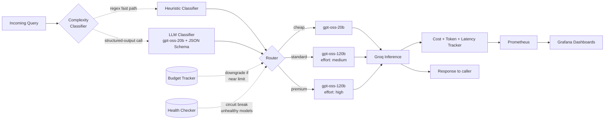
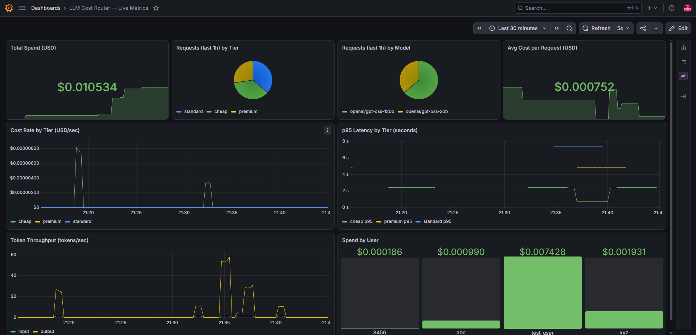
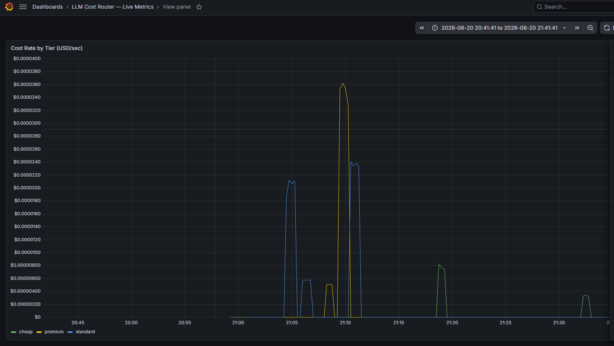
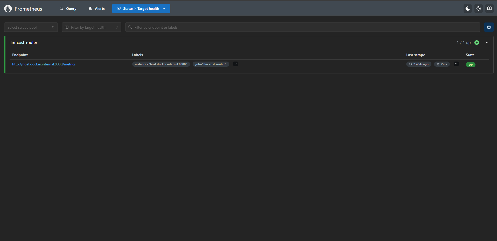

<div align="center">

# ⚡ llm-cost-router

**Route every LLM query to the cheapest model that can actually handle it.**

A production-patterned model router that classifies query complexity, routes across tiers,
tracks cost per request in real time, and degrades gracefully when things go wrong.

[](https://www.python.org/)
[](https://fastapi.tiangolo.com/)
[](https://groq.com/)
[](LICENSE)
[](https://prometheus.io/)
[](https://grafana.com/)
[](https://docs.docker.com/compose/)

[Quickstart](#-quickstart) •
[How it works](#-how-it-works) •
[API](#-api) •
[Metrics & Dashboards](#-metrics--live-dashboards) •
[Screenshots](#-screenshots) •
[Roadmap](#-roadmap)

</div>

---

## 💡 Why this exists

Every LLM query, no matter how trivial, costs the same to send to your most expensive model
as it does to your cheapest one — unless something in between is making a decision. This project
is that decision layer:

- **"What's the capital of France?"** → cheap, fast model
- **"Design a database schema for a multi-tenant billing system"** → capable model, higher cost, justified

No routing logic = you're either overpaying on every trivial query, or under-provisioning on
the queries that actually need a stronger model. This router picks per-request, tracks what
it spent, and degrades safely when budgets or providers misbehave.

## 📐 How it works



| Layer | Responsibility |
|---|---|
| **Classifier** | Dual-mode: fast regex/keyword heuristic, or an LLM classifier constrained to a strict JSON schema for reliable, typed output → tier (`cheap` / `standard` / `premium`) |
| **Router** | Picks the actual model for a tier, applying budget and health overrides |
| **Budget Tracker** | Per-user spend tracking; auto-downgrades users near their limit |
| **Health Checker** | Circuit breaker — stops routing to a model after repeated failures, retries after cooldown |
| **Cost Tracker** | Computes $ cost per request from token usage, exports to Prometheus |
| **Observability** | Prometheus scrapes `/metrics`; Grafana renders live dashboards on top (cost, tiers, latency, tokens) |

## ✨ Features

- 🎯 **Dual-mode complexity classification** — a fast regex/keyword heuristic for the common case, plus an LLM-based classifier that uses a strict JSON Schema (`response_format` with `strict: true`) for reliable, typed tier output instead of parsing free text
- 🧠 **Structured-output reliability** — the LLM classifier's response is validated against a Pydantic schema, with automatic fallback to a safe default tier if the call ever fails
- 💰 **Per-request cost tracking** — exact $ cost computed from real token usage, not estimates
- 🛡️ **Budget-aware downgrading** — users near their spend cap get routed to cheaper tiers automatically instead of erroring
- 🔌 **Circuit breaker** — unhealthy models get skipped, traffic resumes after a cooldown
- 📊 **Prometheus-native metrics** — cost, tokens, and latency, all labeled by model/tier/user
- 📈 **Live Grafana dashboards** — real-time spend, tier distribution, latency percentiles, and token throughput via a fully provisioned `docker-compose` stack (no manual dashboard setup)
- 🧪 **Testable classifier** — labeled eval set + pytest suite to catch regressions before they ship, for both classifier modes
- 🆓 **Zero-cost to run locally** — built and tested against Groq's free tier

## 🏗️ Tech Stack

| Component | Choice |
|---|---|
| API framework | FastAPI + Uvicorn |
| Inference provider | Groq (`openai/gpt-oss-20b`, `openai/gpt-oss-120b`) |
| Classifier (heuristic) | Regex + keyword scoring |
| Classifier (LLM) | Groq structured outputs (`response_format: json_schema`) + Pydantic validation |
| Metrics | `prometheus-client` |
| Dashboards | Prometheus + Grafana via Docker Compose |
| Testing | Pytest |
| Config | `python-dotenv` |

## 🚀 Quickstart

```bash
# 1. Clone and enter the project
git clone https://github.com/<your-username>/llm-cost-router.git
cd llm-cost-router

# 2. Create a virtual environment
python -m venv venv
source venv/bin/activate      # Windows: venv\Scripts\activate

# 3. Install dependencies
pip install -r requirements.txt

# 4. Add your free Groq API key
echo "GROQ_API_KEY=your_key_here" > .env

# 5. Run it
uvicorn app.main:app --reload --port 8000
```

Test it:

```bash
curl -X POST http://localhost:8000/chat \
  -H "Content-Type: application/json" \
  -d '{"query": "What is the capital of France?"}'
```

```json
{
  "answer": "The capital of France is Paris.",
  "tier": "cheap",
  "model": "openai/gpt-oss-20b",
  "routing_reason": "classifier",
  "cost_usd": 0.000012,
  "latency_s": 0.41,
  "total_user_spend_usd": 0.000012
}
```

## 📁 Project Structure

```
llm-cost-router/
├── app/
│   ├── main.py           # FastAPI app + /chat, /metrics, /health endpoints
│   ├── config.py         # Model registry — tiers, pricing, Groq model IDs
│   ├── classifier.py     # Hybrid classifier: regex heuristic + LLM (structured output)
│   ├── router.py         # Routing logic (budget + health aware)
│   ├── budget.py         # Per-user spend tracking
│   ├── health.py         # Circuit breaker for model health
│   ├── cost_tracker.py   # Prometheus metrics + cost computation
│   └── groq_client.py    # Groq API wrapper
├── monitoring/
│   ├── docker-compose.yml           # Prometheus + Grafana stack
│   ├── prometheus/
│   │   └── prometheus.yml           # Scrape config targeting the FastAPI app
│   └── grafana/
│       ├── provisioning/            # Auto-registers datasource + dashboard on startup
│       └── dashboards/
│           └── llm-router-dashboard.json
├── tests/
│   └── test_classifier.py
├── eval/
│   ├── eval_set.json     # Labeled queries for classifier validation
│   └── run_eval.py
├── requirements.txt
└── .env                  # GROQ_API_KEY (not committed)
```

## 🔌 API

### `POST /chat`

| Field | Type | Description |
|---|---|---|
| `query` | `string` | The user's message |
| `user_id` | `string` | Optional, defaults to `"test-user"` — used for budget tracking |

**Response**

| Field | Description |
|---|---|
| `answer` | Model's response text |
| `tier` | Which tier the query was routed to |
| `model` | Actual Groq model ID used |
| `routing_reason` | `classifier` \| `budget_downgrade` \| `health_fallback` |
| `cost_usd` | Computed cost of this request |
| `latency_s` | Time taken for the model call |
| `total_user_spend_usd` | Running total for this user |

### `GET /metrics`
Prometheus-formatted metrics: `llm_request_cost_usd_total`, `llm_request_tokens_total`, `llm_request_latency_seconds` — each labeled by `model`, `tier`, and (for cost) `user_id`.

> Counter metrics get an automatic `_total` suffix on export (a `prometheus_client` / OpenMetrics convention) — Histograms don't, so `llm_request_latency_seconds` keeps its own `_bucket` / `_sum` / `_count` suffixes.

### `GET /health`
Basic liveness check.

## 📊 Metrics & Live Dashboards

Every request updates three Prometheus metrics out of the box:

```
llm_request_cost_usd_total{model="openai/gpt-oss-20b",tier="cheap",user_id="test-user"} 0.000012
llm_request_tokens_total{model="openai/gpt-oss-20b",tier="cheap",direction="input"} 12
llm_request_latency_seconds_bucket{model="openai/gpt-oss-20b",tier="cheap",le="0.5"} 1
```

A fully provisioned **Prometheus + Grafana** stack lives in `monitoring/` — no manual
dashboard setup required. It ships with:

- **Total spend** and **average cost per request**, live
- **Cost rate by tier** — see the savings from routing in real time
- **Request distribution by tier and by model**
- **p95 latency by tier**
- **Token throughput** (input vs. output)
- **Spend by user** — per-tenant cost breakdown

```bash
cd monitoring
docker-compose up -d
```

Then open:
- Prometheus → [http://localhost:9090](http://localhost:9090)
- Grafana → [http://localhost:3000](http://localhost:3000) (login: `admin` / `admin`) — the "LLM Cost Router — Live Metrics" dashboard is already there, pre-provisioned.

## 📸 Screenshots

<!--
Drop your screenshot files into a `docs/screenshots/` folder in the repo root
and point these paths at them, e.g.:
  docs/screenshots/grafana-overview.png
  docs/screenshots/grafana-cost-by-tier.png
  docs/screenshots/prometheus-targets.png
-->

**Grafana — live dashboard overview**


**Grafana — cost rate by tier**


**Prometheus — scrape targets**


## 🧪 Testing & Evaluation

```bash
# Unit tests
pytest tests/ -v

# Classifier accuracy against a labeled eval set
python eval/run_eval.py
```

```
✓ expected=cheap    got=cheap    | What is the capital of Japan?
✓ expected=standard got=standard | Summarize the plot of Romeo and Juliet...
✓ expected=premium  got=premium  | Design a database schema for a multi-tenant...

Accuracy: 5/5 = 100%
```

## 🗺️ Roadmap

- [x] LLM-based classifier with strict JSON Schema output, alongside the regex heuristic
- [x] `docker-compose.yml` for Prometheus + Grafana, auto-provisioned dashboards
- [ ] Semantic caching layer (Redis) to skip redundant model calls entirely
- [ ] SQLite-backed budget persistence (survives restarts)
- [ ] Hybrid routing: regex fast-path first, LLM classifier only for ambiguous cases
- [ ] Shadow-mode traffic replay for safely testing classifier changes
- [ ] Prometheus alerting rules (latency spikes, spend-rate anomalies)
- [ ] Support for additional providers behind the same router interface

## 🤝 Contributing

Issues and PRs welcome. If you're adding a new provider or tier strategy, please include
a test case in `eval/eval_set.json` demonstrating it routes correctly.

## 📄 License

MIT — see [LICENSE](LICENSE).

---

<div align="center">
<sub>Built as a hands-on exploration of production AI engineering patterns — routing, cost control, and observability.</sub>
</div>